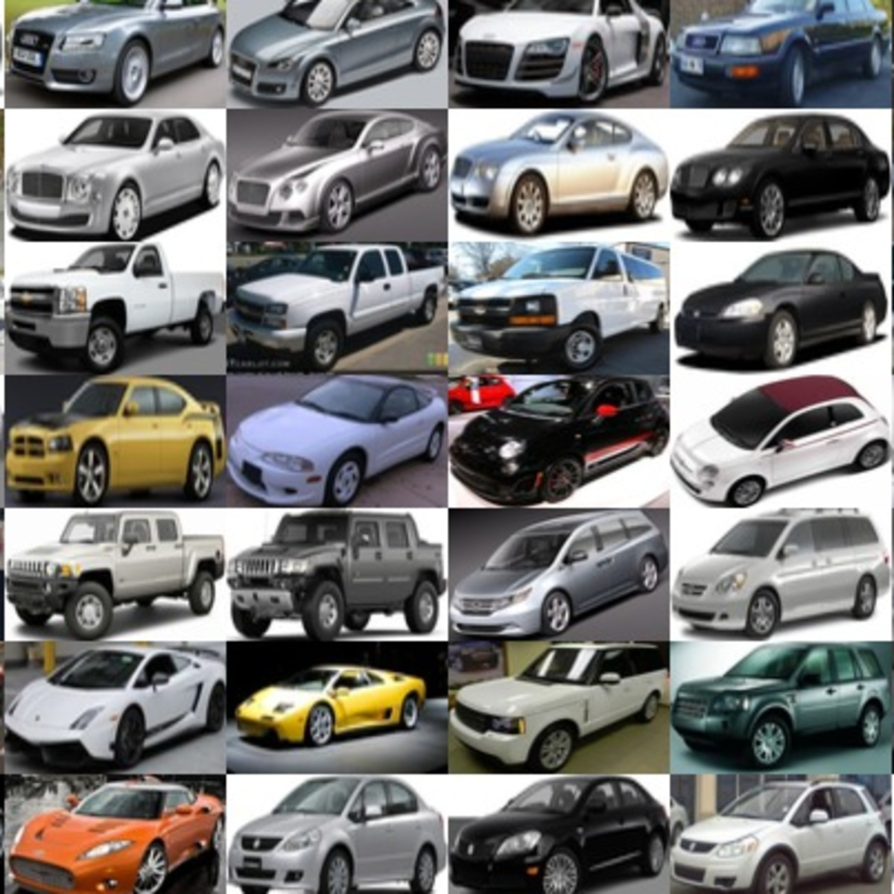

# Car Make & Model Prediction with Xception 

This project aims to build a program which can identify the make and model of a car from an image. 

The completion of this project has the potential to, when used with real world data, assist in identifying vehicles involved in car accidents, traffic violations, and other vehicle-related infractions. 

## Dependencies

```bash
TensorFlow
Keras
matplotlib
numpy
pandas
```


## Dataset

The dataset used for this project was the Stanford Cars Dataset, which contains 16,185 images of 196 types of cars.

{width=400px}

The original dataset was originally located [here](https://ai.stanford.edu/~jkrause/cars/car_dataset.html), but the link has been broken for a few years prior to the start of this project. While many sites where the dataset was secondarily uploaded contain mistakes or an incomplete suite of the necessary resources, we were able to piece together the original and correct information with some research.

The full, original dataset can be found in a few other locations online:
- The [images](https://www.kaggle.com/datasets/jessicali9530/stanford-cars-dataset) of the cars
- The [annotations](https://www.kaggle.com/datasets/meaninglesslives/cars-devkit) matricies, containing data about the images (their respective images, the car's make and model, and the bounding box coordinates for each image)

### The images

The images provided by the dataset are small JPGs with slight deviations in size. Most are already relatively closely cropped to capture less extraneous information.


### The annotations

The metadata for the images is divided into two general categories of matricies: a smaller one to hold the references for car class name (a value between 1 and 196) and its associated make and model, and a larger one to connect each image's file name with its bounding box coordinates and class number. 


## List of Tasks performed

- [x] Preparing the dataset
- [x] Choosing a model
- [x] Training the model
- [x] Evaluating the model
- [x] Tuning parameters
- [x] Testing the model

### Final Results


